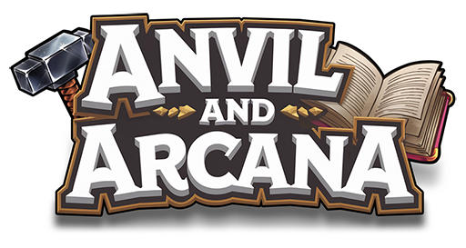

<div align="center">
   
</div>

**Anvil and Arcana** is a module for **[Foundry Virtual Tabletop](https://foundryvtt.com/)** designed for use with the **[Warhammer Fantasy Roleplay 4th Edition](https://foundryvtt.com/packages/wfrp4e)** system. It introduces an intuitive system for crafting and managing recipes, allowing players and Game Masters to enrich their gameplay with simple crafting mechanics.

## Features

- **Recipe Creation**: Easily define recipes for items, including materials and skill requirements.
- **Crafting System**: Use tools to craft items and success rolls seamlessly.
- **Integration with WFRP 4e**: Fully compatible with the Warhammer Fantasy 4th Edition system in Foundry VTT.
- **User-Friendly Interface**: Intuitive design for both Game Masters and players to use.

## Installation

To install **Anvil and Arcana**:
1. Open the **Foundry VTT Setup** screen.
2. Navigate to the **Add-on Modules** tab.
3. Click on **Install Module**.
4. In the manifest URL field, paste the following link:
   ```
   https://github.com/alexey-potory/anvil-and-arcana-wfrp4/releases/latest/download/module.json
   ```
5. Click **Install** and enable the module in your world settings.

## Compatibility

- **Foundry VTT**: Version 12+
- **WFRP 4th Edition System**: Fully supported and verified.

## Supported Languages

**Anvil and Arcana** is currently available in the following languages:
- **English** (default)
- **Russian**

The module automatically adjusts to the language settings of your Foundry VTT instance, provided the chosen language is supported. If you'd like to contribute translations for additional languages, feel free to reach out or submit a pull request on GitHub!

## For Developers

**Anvil and Arcana** is built with **TypeScript** and uses **Vite** for module bundling and development. There are two Vite configuration files:

- **`vite.config.prod.js`**: This configuration is used for production builds. It ensures the final script is minimized for optimal performance in a live environment.
- **`vite.config.js`**: This configuration is used for development, providing a faster and more flexible environment for building and testing changes.

The module is distributed in its **ready-to-use** form in the releases section, so players and Game Masters can install and use it directly. However, for those who wish to modify or rebuild the module, Node.js is required to run the build process.

To rebuild the module, follow these steps:
1. Ensure that **Node.js** is installed on your system.
2. Run the following command to install dependencies:
   ```bash
   npm install
   ```
3. To build the module, use:
   ```bash
   npx vite build
   ```
This will compile the TypeScript code according to the production configuration. The final output will be located in the `/dist` folder, ready for deployment.

## Feedback and Support

We’d love to hear your feedback! Feel free to report bugs or suggest features through our [GitHub Issues page](https://github.com/alexey-potory/anvil-and-arcana-wfrp4/issues).

## License

This module is licensed under the **MIT License**. See the [LICENSE](./LICENSE) file for more details.

---

Happy crafting, and may your hammers always strike true! 🛠️
